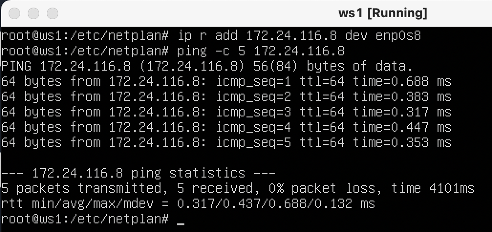
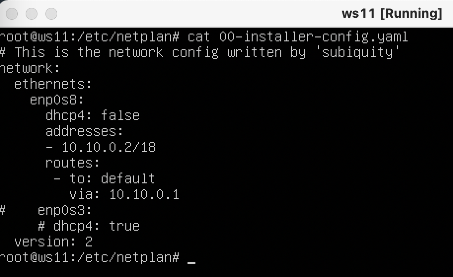
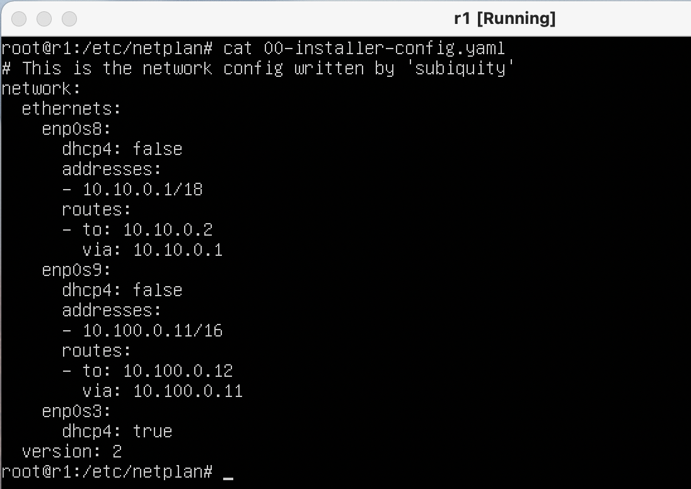
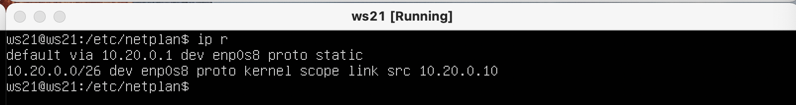
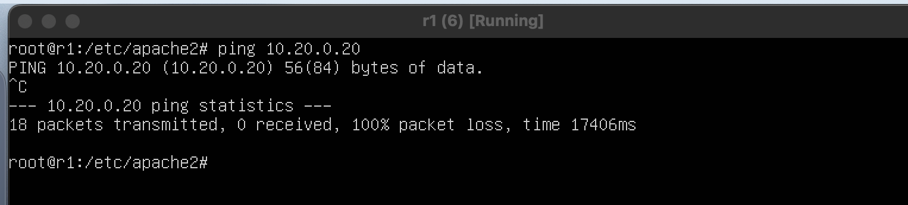

# Сети в Linux

Настройка сетей в Linux на виртуальных машинах.

# Contents

1. [Part 1. Инструмент ipcalc](#part-1-инструмент-ipcalc) \
    1.1 [Сети и маски](#11-сети-и-маски) \
    1.2 [localhost](#12-localhost) \
    1.3 [Диапазоны и сегменты сетей](#13-диапазоны-и-сегменты-сетей)
2. [Part 2. Статическая маршрутизация между двумя машинами](#part-2-статическая-маршрутизация-между-двумя-машинами) \
    2.1 [Добавление статического маршрута вручную](#21-добавление-статического-маршрута-вручную) \
    2.2 [Добавление статического маршрута с сохранением](#22-добавление-статического-маршрута-с-сохранением)
3. [Part 3. Утилита iperf3](#part-3-утилита-iperf3) 
4. [Part 4. Сетевой экран](#part-4-сетевой-экран) \
   4.1 [Утилита iptables](#41-утилита-iptables) \
   4.2 [Утилита nmap](#42-утилита-nmap)
5. [Part 5. Статическая маршрутизация сети](#part-5-статическая-маршрутизация-сети) \
   5.1 [Настройка адресов машин](#51-настройка-адресов-машин)\
   5.2 [Включение переадресации IP-адресов](#52-включение-переадресации-ip-адресов)\
   5.3 [Установка маршрута по-умолчанию](#53-установка-маршрута-по-умолчанию)\
   5.4 [Добавление статических маршрутов](#54-добавление-статических-маршрутов)\
   5.5 [Построение списка маршрутизаторов](#55-построение-списка-маршрутизаторов)\
   5.6 [Использование протокола ICMP при маршрутизации](#56-использование-протокола-icmp-при-маршрутизации)
6. [Part 6. Динамическая настройка IP с помощью DHCP](#part-6-динамическая-настройка-ip-с-помощью-dhcp)
7. [Part 7. NAT](#part-7-nat)

# Part 1. Инструмент ipcalc

## 1.1. Сети и маски

1) Адрес сети 192.167.38.54/13


2) Перевод маски 255.255.255.0 в префиксную и двоичную запись, /15 в обычную и двоичную, 11111111.11111111.11111111.11110000 в обычную и префиксную

Перевод маски 255.255.255.0 в префиксную и двоичную запись:


/15 в обычную и двоичную:


11111111.11111111.11111111.11110000 в обычную и префиксную:


3) Минимальный и максимальный хост в сети 12.167.38.4 при масках: /8, 11111111.11111111.00000000.00000000, 255.255.254.0 и /4

12.167.38.4/8


12.167.38.4 11111111.11111111.00000000.00000000


12.167.38.4 255.255.254.0


12.167.38.4/4


## 1.2. localhost

> Определи и запиши в отчёт, можно ли обратиться к приложению, работающему на localhost, со следующими IP: 194.34.23.100, 127.0.0.2, 127.1.0.1, 128.0.0.1

Можно обратиться по localhost со следующими IP:

- 127.0.0.2
- 127.1.0.1

> Адрес обратной связи — это отдельный зарезервированный диапазон IP-адресов , который начинается с 127.0.0.0 и заканчивается на 127.255.255.255, хотя 127.255.255.255 является широковещательным адресом для 127.0.0.0/8. Адреса обратной связи встроены в систему домена IP, что позволяет устройствам передавать и получать пакеты данных. Адрес обратной связи 127.0.0.1 обычно известен как localhost.

## 1.3. Диапазоны и сегменты сетей

>Определи и запиши в отчёт: 

> 1. Какие из перечисленных IP можно использовать в качестве публичного, а какие только в качестве частных: 10.0.0.45, 134.43.0.2, 192.168.4.2, 172.20.250.4, 172.0.2.1, 192.172.0.1, 172.68.0.2, 172.16.255.255, 10.10.10.10, 192.169.168.1

Частные:

- 10.0.0.45
- 192.168.4.2
- 172.20.250.4
- 172.16.255.255
- 10.10.10.10

Публичные:

- 134.43.0.2
- 172.0.2.1
- 192.172.0.1
- 172.68.0.2
- 192.169.168.1

> 2. Какие из перечисленных IP адресов шлюза возможны у сети 10.10.0.0/18: 10.0.0.1, 10.10.0.2, 10.10.10.10, 10.10.100.1, 10.10.1.255

- 10.10.0.2
- 10.10.10.10

# Part 2. Статическая маршрутизация между двумя машинами

> Подними две виртуальные машины (далее -- ws1 и ws2). С помощью команды `ip a` посмотри существующие сетевые интерфейсы.

ws1


ws2


> Опиши сетевой интерфейс, соответствующий внутренней сети, на обеих машинах и задать следующие адреса и маски: ws1 - 192.168.100.10, маска /16, ws2 - 172.24.116.8, маска /12.

ws1


ws2


## 2.1 Добавление статического маршрута вручную

> Добавь статический маршрут от одной машины до другой и обратно при помощи команды вида `ip r add`.

> Выполни команду `netplan apply` для перезапуска сервиса сети.

ws 1



ws 2


## 2.2. Добавление статического маршрута с сохранением

> Добавь статический маршрут от одной машины до другой с помощью файла etc/netplan/00-installer-config.yaml.

>Пропингуй соединение между машинами.

ws 1


ws 2


# Part 3. Утилита iperf3

> Измерь скорость соединения между ws1 и ws2.

ws 1 `iperf3 -c 172.24.116.8`


ws 2 `iperf3 -s`


# Part 4. Сетевой экран

## 4.1. Утилита iptables

> 1) На ws1 примени стратегию, когда в начале пишется запрещающее правило, а в конце пишется разрешающее правило (это касается пунктов 4 и 5). 

> 2) На ws2 примени стратегию, когда в начале пишется разрешающее правило, а в конце пишется запрещающее правило (это касается пунктов 4 и 5). 

> 3) Открой на машинах доступ для порта 22 (ssh) и порта 80 (http). 

> 4) Запрети echo reply (машина не должна «пинговаться», т.е. должна быть > блокировка на OUTPUT). 

> 5) Разреши echo reply (машина должна «пинговаться»).

ws1 


ws2


ws1 


ws2


> В отчёте опиши разницу между стратегиями, применёнными в первом и втором файлах

Исходя из результата применямых стратегий можно сказать, что последние изменения в iptables и будут пременены.

## 4.2 Утилита nmap

>Командой ping найди машину, которая не «пингуется», после чего утилитой nmap покажи, что хост машины запущен.


# Part 5. Статическая маршрутизация сети

## 5.1. Настройка адресов машин

> Настрой конфигурации машин в etc/netplan/00-installer-config.yaml согласно сети на рисунке.

ws 11



r1



r2


ws21


ws22


> Перезапусти сервис сети. Если ошибок нет, то командой ip -4 a проверь, что адрес машины задан верно. Также пропингуй ws22 с ws21. Аналогично пропингуй r1 с ws11.

`ping r1 to ws11`


`ping ws21 to ws22`


ws11


ws22


r2


## 5.2. Включение переадресации IP-адресов

> Для включения переадресации IP, выполни команду на роутерах:
`sysctl -w net.ipv4.ip_forward=1`

> При таком подходе переадресация не будет работать после перезагрузки системы.

r1


r2


>Открой файл /etc/sysctl.conf и добавь в него следующую строку:
net.ipv4.ip_forward = 1. При использовании этого подхода, IP-переадресация включена на постоянной основе.

r1


r2


## 5.3. Установка маршрута по-умолчанию

> Настрой маршрут по-умолчанию (шлюз) для рабочих станций. Для этого добавь default перед IP роутера в файле конфигураций.

ws 11


ws21


ws22


>Вызови ip r и покажи, что добавился маршрут в таблицу маршрутизации.

ws 11


ws21



ws22


> Пропингуй с ws11 роутер r2 и покажи на r2, что пинг доходит. Для этого используй команду:

`tcpdump -tn -i eth0`

ws 11


r 2


## 5.4. Добавление статических маршрутов

 > Добавь в роутеры r1 и r2 статические маршруты в файле конфигураций. Пример для r1 маршрута в сетку 10.20.0.0/26:

```shell
# Добавь в конец описания сетевого интерфейса eth1:
- to: 10.20.0.0
  via: 10.100.0.12
```

r 1


r 2


> Вызови ip r и покажи таблицы с маршрутами на обоих роутерах.

r 1


r 2


> Запусти команды на ws11: `ip r list 10.10.0.0/[маска сети]` и `ip r list 0.0.0.0/0`

ws 11


> В отчёте объясни, почему для адреса 10.10.0.0/[маска сети] был выбран маршрут, отличный от 0.0.0.0/0, хотя он попадает под маршрут по-умолчанию.

Был выбран отличный путь потому что при наличии нескольких маршрута одинаковой длины будет выбран наиболее точно заданый маршрут

## 5.5. Построение списка маршрутизаторов

> Запусти на r1 команду дампа: `tcpdump -tnv -i enp0s8`

r1:


> При помощи утилиты traceroute построй список маршрутизаторов на пути от ws11 до ws21.

ws11:


Исходя из дампа полученого из r1 можно сказать что traceroute отправляет UDP-пакеты yf j

Traceroute — это утилита диагностики сети, которая отправляет три пакета протокола пользовательских дейтаграмм (UDP) с увеличивающимися значениями времени жизни (TTL) на указанный порт на целевом хосте вместо использования запросов протокола управляющих сообщений Интернета (ICMP). Первоначальный пакет имеет значение TTL, равное 1, за ним следует второй пакет со значением TTL, равным 2, и так далее, пока запрос не достигнет предполагаемого получателя. Каждый запрос UDP содержит порты отправителя и получателя; обычно по умолчанию используется порт 34434. Как только запрос достигает хоста назначения, он отвечает «Порт назначения недоступен», указывая, что цель получила запрос. Получив этот ответ, трассировка считает завершенной. Этот подход позволяет трассировке более точно идентифицировать промежуточные узлы между двумя хостами, чем при использовании исключительно сообщений ICMP.

## 5.6. Использование протокола ICMP при маршрутизации

> Запусти на r1 перехват сетевого трафика, проходящего через eth0 с помощью команды: `tcpdump -n -i eth0 icmp`


> Пропингуй с ws11 несуществующий IP


# Part 6. Динамическая настройка IP с помощью DHCP

установка isc-dhcp-server

`sudo apt-get install isc-dhcp-server`

> Укажи адрес маршрутизатора по-умолчанию, DNS-сервер и адрес внутренней сети


> Перезагрузи службу DHCP командой systemctl restart isc-dhcp-server.


> Машину ws21 перезагрузи при помощи reboot и через ip a покажи, что она получила адрес.


> Также пропингуй ws22 с ws21.


> Укажи MAC адрес у ws11, для этого в etc/netplan/00-installer-config.yaml надо добавить строки: macaddress: 10:10:10:10:10:BA, dhcp4: true.


> Для r1 настрой аналогично r2, но сделай выдачу адресов с жесткой привязкой к MAC-адресу (ws11). Проведи аналогичные тесты.

r1:

настройка dhcp server


nameserver 8.8.8.8


restart isc-dhcp-server


проверка ws11


> Запроси с ws21 обновление ip адреса.

before:


запрос:


after:


Я использовал dhclient адаптер для получения нового адресса.

# Part 7. NAT

> В файле /etc/apache2/ports.conf на ws22 и r1 измени строку Listen 80 на Listen 0.0.0.0:80, то есть сделай сервер Apache2 общедоступным.

r1:


ws22:


> Запусти веб-сервер Apache командой service apache2 start на ws22 и r1

r1:


ws22:


> Добавь в фаервол, созданный по аналогии с фаерволом из Части 4, на r2 следующие правила:
> 1) Удаление правил в таблице filter - iptables -F;
> 2) Удаление правил в таблице "NAT" - iptables -F -t nat;
> 3) Отбрасывать все маршрутизируемые пакеты - iptables --policy FORWARD DROP.
> Запусти файл также, как в Части 4.
> Проверь соединение между ws22 и r1 командой ping.

r2:


r1:



> **4) Разрешить маршрутизацию всех пакетов протокола ICMP.
> Запусти файл также, как в Части 4.
> Проверь соединение между ws22 и r1 командой ping.**

r2:


r1:


> **5) Включи SNAT, а именно маскирование всех локальных ip из локальной сети, находящейся за r2 (по обозначениям из Части 5 - сеть 10.20.0.0).**


На сегодняшний день распространены два типа NAT: Source NAT (SNAT) и Destination NAT (DNAT). Различия между ними связаны с тем, какой адрес изменяется во время обработки трафика. SNAT (известный в тесных IT-шных кругах под названием маскарадинг) меняет информацию об IP-адресе источника (src ip).

В каких случаях вам может пригодиться SNAT:

* При необходимости направить трафик из Private Networks (RFC 1918) в сеть INTERNET (классический и самый распространенный случай);
* При желании скрыть группу IP адресов за одним IP адресом для анонимизации источников трафика;
* Для перенаправления трафика в сеть, которую вы не контролирует или на узлы на которых нет возможности добавить обратный маршрут (нет желания и необходимости в этом);
* В различных экзотических задачах по перехвату трафика для последующего анализа.

Destination NAT (Network Address Translation) — это метод перенаправления сетевых пакетов, применяемый в сетях компьютеров и компьютерных сетях для изменения адреса назначения пакета. Он применяется на уровне сетевого протокола, чтобы перенаправить пакеты на другие узлы сети.

>  Проверь соединение по TCP для SNAT: для этого с ws22 подключиться к серверу Apache на r1 командой:
> telnet [адрес] [порт]
> Проверь соединение по TCP для DNAT: для этого с r1 подключиться к серверу Apache на ws22 командой telnet (обращаться по адресу r2 и порту 8080).

r2:


r1: 


ws22:


[up](#contents)